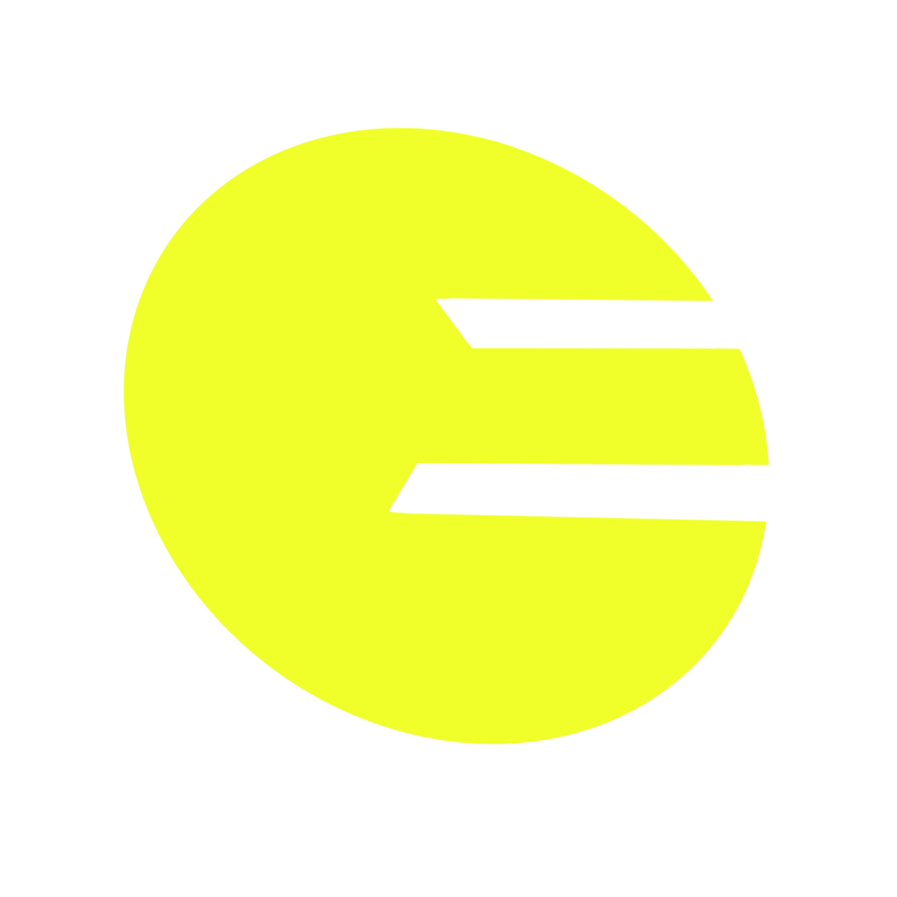
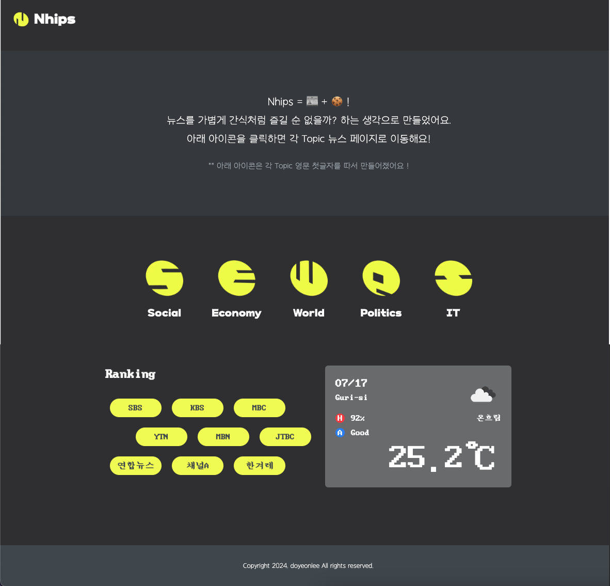
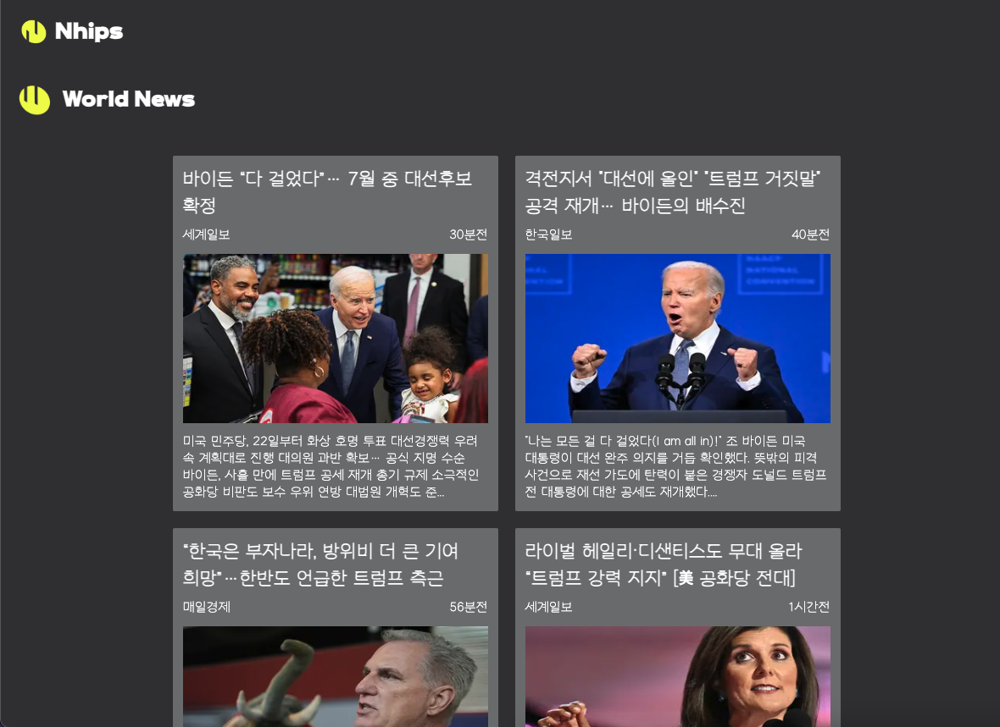
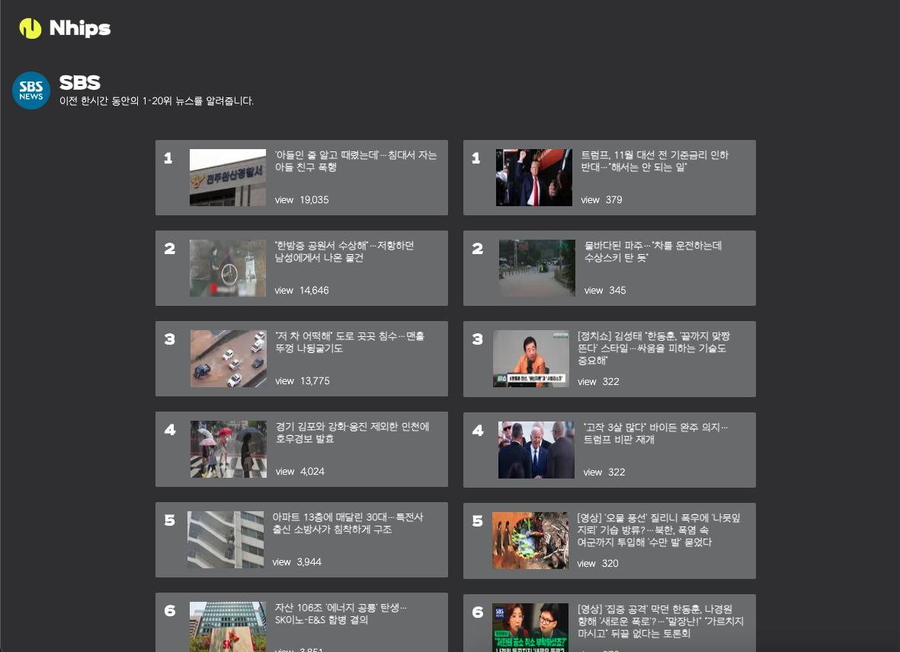

## Nhips = News + Chips

 

・ 배포 URL : [https://nhips.vercel.app](https://nhips.vercel.app)

 

## Nhips 소개

- News와 Chips의 합성어로 뉴스를 가볍게 간식처럼 즐길 순 없을까?하는 생각으로 만들었어요.
- Nhips의 뉴스 API는 네이버 뉴스를 크롤링하여 만들었어요.
- 사회, 경제, 세계, 정치, IT 뉴스를 볼 수 있어요.
- 언론사별 랭킹 뉴스를 볼 수 있어요.
- 현재 위치의 날씨를 간단히 알 수 있어요.

 

## 개발 환경

- FE : Next.js, Typescript, Tailwindcss, zustand, cheerio
- Deploy : Vercel
- Design : [Figma](https://www.figma.com/design/2H1hVZBGeWsm2HYF433A0V/nhips?node-id=0-1&t=oN0DhzkH7euDqiWU-1)

 

## 페이지별 기능

### 메인 페이지

- 사회, 경제, 세계, 정치, IT 뉴스를 볼 수 있습니다.
- 언론사별 랭킹 뉴스 페이지로 진입할 수 있는 버튼이 있습니다.
- 현재 위치의 간단한 날씨 및 대기 오염도를 알 수 있습니다.

| 메인 페이지 |
|----------|
|  |

 

### 분야별 뉴스 페이지

- 메인 페이지 토픽 버튼을 통해 진입 가능합니다.
- 각 분야별 뉴스를 확인할 수 있습니다.
- 뉴스 카드의 헤드라인이나 사진을 클릭하면 뉴스 상세 페이지로 이동합니다.

| 분야별 뉴스 페이지 |
|----------|
|  |

 

### 언론사별 랭킹 페이지

- 메인 페이지 랭킹 섹션의 언론사 버튼을 눌러서 진입 가능합니다.
- 언론사별 1시간 동안의 1-20위까지의 뉴스 랭킹을 알려줍니다.
- 각 뉴스의 이미지와 헤드라인을 클릭하면 상세 뉴스 페이지로 이동합니다.

| 언론사별 랭킹 페이지 |
|----------|
|  |

 
